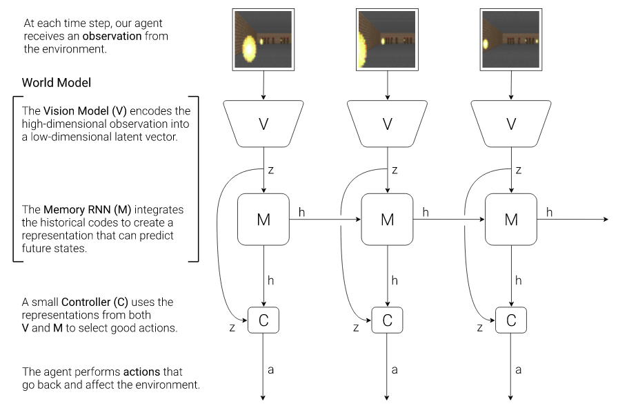

[](https://opensource.org/licenses/MIT)

# World-Models
Reimplementation of [World Models](https://worldmodels.github.io) using [HumbleRL](https://github.com/piojanu/humblerl)
framework. Allows to easily train a world model on [OpenAI Gym](https://gym.openai.com/) environments.

## Getting started
Clone this repository and install requirements: `pip install -r requirements.txt`

## Basic usage
`python run.py [OPTIONS] COMMAND ARGS`

To see script-level help, run: `python run.py --help`.
Note: By default, logs from TensorFlow are hidden by setting `TF_CPP_MIN_LOG_LEVEL` environment variable to value of 3. To change it, define environment variable `TF_CPP_MIN_LOG_LEVEL`.

Command-line options:

```
-c, --config-path    - Path to .json config (Default: "config.json")
--debug/--no-debug   - Enable debug level logging (Default: False)
--quiet/--no-quiet   - Disable info level logging (Default: False)
--render/--no-render - Vision/Memory will save example plots, Memory needs to get Vision ckpt path in arguments (Default: False)
```

**Note**: For some games (e.g. [CarRacing-v0](https://gym.openai.com/envs/CarRacing-v0/)), you need to add `--render` option
for every command in which the environment is directly interacted with (`record_data`, `train_ctrl`, `eval`) -
that's because some games need to actually render the window to generate proper frames during `env.step()`
([CarRacing issue](https://github.com/openai/gym/issues/976)).

### Config
Parameters used in training and evaluation are stored in JSON config.

By default, `config.json.dist` will be used. To customize configuration you can provide your own config using option `-c PATH`.
Default custom config filename is `config.json`.

If you don't specify some parameter in .json config, then default value from `config.json.dist` is used.

### Commands
Commands correspond to different actions you can perform with `run.py`.

To see available commands, run: `python run.py --help`.

To see command-level help, run: `python run.py COMMAND --help`.

Commands are described below, in context of training a world model from scratch.


## World Model
World model consists of 3 parts:
* **Vision (V)**, which is responsible for encoding the high-dimensional observation into low-dimensional latent state (VAE),
* **Memory (M)**, which encodes the history and is trained to predict future states (MDN-RNN),
* **Controller (C)**, which uses V (as current observation summary) and M (as temporal summary) to select actions (CMA-ES).



_Image taken from original paper._

For more information on World Models, see the original [website](https://worldmodels.github.io) or
[paper](https://arxiv.org/abs/1803.10122).

## Training
Vision, Memory and Controller need to be trained separately, in this order.

### General config parameters
Most of the parameters (environment, architecture, paths, etc.) are controlled by a JSON config (see config.json.dist).
The general parameters are described here, the rest is covered within appropriate context.

```
"general": {
    "game_name"        : "Boxing-v0",            -- Name of the game we want to play (see OpenAI Gym enviroments).
    "state_shape"      : [64, 64, 3],            -- Shape of state (game frame) we want to work on. If frame shape is
                                                 -- different, it will be reshaped before operating on it.
    "crop_range"       : "[30:183, 28:131, :]"   -- What we want to crop from game frame. Since some games have
                                                 -- redundant information (e.g. score, time), we can remove this
                                                 -- information by performing the crop operation for every axis.
    "generating_agent" : "random"                -- Agent to use for data generation. By default, a random agent is used
                                                 -- but for same games, e.g. CarRacing-v0, it's not enough to properly
                                                 -- explore the game. For CarRacing-v0, use "car_racing" agent.
}
```

### Vision training
#### Collect transitions for Vision training
To train the Vision, we need to first collect the dataset to train on. The transitions are generated by a random agent
and stored in HDF5 file, that will later be used to train the Vision component.

To record the transitions to `data/vae.hdf5` file, run:

`python run.py record_data data/vae.hdf5`

Command-line options:

```
-n, --n_games     - Number of games to play (Default: 10000)
-c, --chunk_size  - HDF5 chunk size (Default: 128)
-t, --state_dtype - Numpy data type of state (Default: uint8)
```

#### Train Vision component
We can use collected trajectories, to train a
[Variatonal Autoencoder](https://jaan.io/what-is-variational-autoencoder-vae-tutorial/),
which will act as our Vision component.

To train the Vision component, run:

`python run.py train_vae data/vae.hdf5`

Config options:

```
"vae_training": {
    "batch_size"       : 256,
    "latent_space_dim" : 16,                   -- Size of latent space vector, which is the result of feature extraction
                                               -- done by VAE on input observation (game frame).
    "epochs"           : 300,
    "learning_rate"    : 0.001,
    "patience"         : 5,                    -- After this many epochs, if validation loss does not improve, the training is stopped.
    "ckpt_path"        : "./ckpt/vision.ckpt", -- Path to best model (checkpoint).
    "logs_dir"         : "./logs"              -- Path to directory with logs.
}
```

Best model will be saved to and loaded from `ckpt_path`.

### Memory training
#### Prepare gathered transitions for Memory training
Using trained Vision module, we can preprocess states gathered by `record_data` and save them in a different HDF5 file
(other data in HDF5 stays the same, e.g. actions). This new dataset can be later used to train the Memory component.

To convert transitions stored in `data/vae.hdf5` file using VAE model specified in config and save them to 
`data/mem.hdf5`, run:

`python run.py convert_data data/vae.hdf5 data/mem.hdf5`

Command-line options:

```
-v, --vae_path - Path to VAE ckpt. Taken from .json config if `None` (Default: None)'
```

#### Train Memory component
We can use collected trajectories, to train a
MDN-RNN ([Mixture Density Network Recurrent Neural Network]( https://mikedusenberry.com/mixture-density-networks)), which will
act as our Memory component.

To train the Memory component, run:

`python run.py train_mem data/mem.npz`

Config options:

```
"rnn_training": {
    "batch_size"         : 128,
    "sequence_len"       : 1000,                 -- Sequence length to use in RNN. If recorded episode is shorter, it will
                                                 -- be padded with zeros.
    "terminal_prob"      : 0.2,                  -- Probability that sampled sequence will finish with terminal state.
    "dataset_fraction"   : 1.0,                  -- Fraction of dataset to use during training, value range: (0, 1] (dataset forepart is taken).
    "hidden_units"       : 256,                  -- Number of neurons in RNN's hidden state.
    "n_gaussians"        : 5,                    -- Number of Gaussian distributions in mixture.
    "temperature"        : 1.0,                  -- Temperature parameter, used to control model uncertainty.
    "epochs"             : 1000,
    "learning_rate"      : 0.001,
    "patience"           : 10,                   -- After this many epochs, if validation loss does not improve, the training is stopped.
    "rend_n_rollouts"    : 10,                   -- Render N simulated steps using memory module. Can't be greater than sequence_len/2.
    "rend_n_episodes"    : 12,                   -- Render visualization for N episodes.
    "rend_step"          : 4,                    -- Render every Nth frame. rend_step*rend_n_rollouts can't be greater than sequence_len/2
    "ckpt_path"          : "./ckpt/memory.ckpt", -- Path to best model (checkpoint).
    "logs_dir"           : "./logs"              -- Path to directory with logs.
}
```

Best model will be saved to and loaded from `ckpt_path`.

### Controller training
Now that we have trained Vision and Memory components, we can train the final part, which is used to perform actions -
the Controller. The training is performed using
[Covariance-Matrix Adaptation Evolution Strategy](http://blog.otoro.net/2017/10/29/visual-evolution-strategies/) (CMA-ES),
which can be easily parallelized on CPU.

To train the Controller with disabled OMP parallelism, run:

`OMP_NUM_THREADS=1 python run.py train_ctrl`

Config options:

```
"es_training": {
    "epochs"           : 300,
    "popsize"          : 64,                       -- Size of the population.
    "n_episodes"       : 5,                        -- Number of episodes to play per each member of the population.
                                                   -- The fitness score is calculated as average score from these games.
    "processes"        : -1,                       -- Number of processes to use, -1 means all processors will be used.
    "l2_decay"         : 0.01,                     -- L2 weight decay rate.
    "ckpt_path"        : "./ckpt/controller.ckpt", -- Path to CMA-ES training checkpoint.
    "mind_path"        : "./cpkt/mind.ckpt",       -- Path to weights of Controller.
    "logs_dir"         : "./logs"                  -- Path to directory with logs.
}
```

Best Controller model will be saved to and loaded from `ckpt_path`. Weight for Mind will be saved to `mind_path_prefix``suffix` files, where the suffix for best solution `_best.ckpt` and the suffix for mean solution is `_mean.ckpt`.
Note: Controller's training is executed only on CPUs, it is highly recommended to setup environment variable `OMP_NUM_THREADS=1` to reduce not needed CPU utilization.

## Evaluation
After training all the components of our World Model, we can put it all together and evaluate it on the game we chose.

To do this on CPU, using models specified in config, run:

`CUDA_VISIBLE_DEVICES= python run.py eval`

Command-line options:

```
-n, --n_games         - Number of games to play (Default: 3)
-v, --vae_path        - Path to VAE ckpt. Taken from .json config if `None` (Default: None)')
-m, --mdn_path        - Path to MDN-RNN ckpt. Taken from .json config if `None` (Default: None)')
-c, --controller_path - Path to Controller weights. Taken `best` version from .json config if `None` (Default: None)')
```
